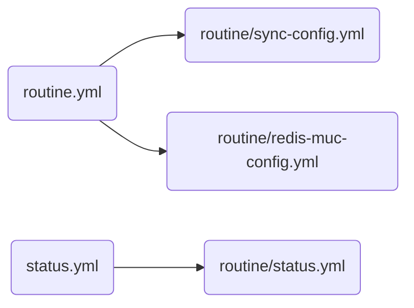

# Flow

```mermaid
graph LR
routine.yml(routine.yml) --> routine/sync-config.yml(routine/sync-config.yml)
routine.yml(routine.yml) --> routine/redis-muc-config.yml(routine/redis-muc-config.yml)
status.yml(status.yml) --> routine/status.yml(routine/status.yml)
```